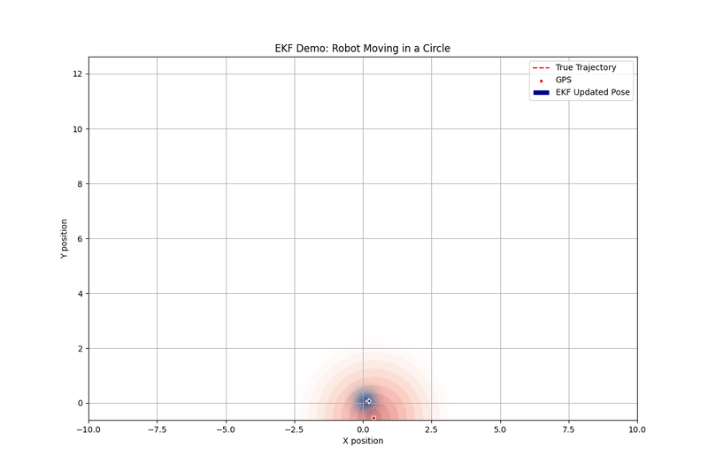

# MathematicalRobotics

## What is this?
The development of robotics is always closely related to mathematics. However, pure mathematical expressions can sometimes be boring and difficult to understand. This project aims to show the magic of mathematics through interesting robotics demonstrations.

## The goals of our project.
We aim to select widely used and practical algorithms. For each algorithm, we strive to:
* Provide a readable Python implementation.
* Show a detailed mathematical proof.
* Minimize the use of third-party libraries to reveal the underlying mathematics.

## Install

1. Install `libsuitesparse-dev` if you want to use the sparse solver.
```bash
sudo apt-get install -y libsuitesparse-dev
```
2. Install `mathR` (this repository):
```bash
git clone https://github.com/scomup/MathematicalRobotics.git
cd MathematicalRobotics
pip3 install -e .
```

Alternatively, install `mathR` directly from the git URL:
```bash
pip install -e git+https://github.com/scomup/MathematicalRobotics.git#egg=mathR
```

# Demo Lists

## gauss_newton_method

The Gauss-Newton method is a numerical optimization technique that is especially effective for solving non-linear least squares problems. We have implemented a pure Python library for this method.

**Documentation Links:**
* [Gauss-Newton Method Document](docs/gauss_newton_method.pdf)
* [Newton Method Document](docs/newton_method.pdf)

We also provide some demos on Lie-group-based point matching using our library.

**Lie Group Documentation Links:**
* [SO3 group](docs/3d_rotation_group.pdf)
* [SE3 group](docs/3d_transformation_group.pdf)

### Gauss-Newton for 2D points matching
```bash
python3 -m mathR.gauss_newton_method.demo_2d
```


### Gauss-Newton for 3D points matching
```bash
python3 -m mathR.gauss_newton_method.demo_3d
```


### Gauss-Newton for linear regression
```bash
python3 -m mathR.gauss_newton_method.demo_line
```

### Graph Optimization
We have developed a graph optimization library implemented in pure Python. Compared to well-known graph optimization libraries like g2o, gtsam, or ceres, our implementation is highly readable and ideal for studying purposes.

[Graph Optimization Document](docs/graph_optimization.pdf)

### 2D pose graph problem
This demo solves a 2D point matching problem using the Gauss-Newton method.

```bash
python3 -m mathR.graph_optimization.demo_g2o_se2
```

Dataset: sphere2500.g2o [^1]


### 3D pose graph problem

This demo showcases the application of Gauss-Newton in 3D point matching problems.

```bash
python3 -m mathR.graph_optimization.demo_g2o_se3
```
Dataset: manhattanOlson3500.g2o [^1]


[^1]: Datasets are available in the open-source package [Vertigo](https://github.com/OpenSLAM-org/openslam_vertigo).

### Gauss-Newton for Linear Regression

This demo illustrates how the Gauss-Newton method can be applied to solve a simple linear regression problem

```bash
python3 -m mathR.gauss_newton_method.demo_line
```

## Filters

Filtering techniques, such as the Extended Kalman Filter (EKF) and Particle Filter (PF), are essential tools in robotics for state estimation in the presence of noise and uncertainty.

### Extended Kalman Filter (EKF) Demo

This demo illustrates how the EKF can be used for GPS and odometry fuse problem.

```bash
python3 -m mathR.filter.demo_ekf
```


### Particle Filter (PF) Demo
This demo illustrates how the PF can be used for GPS and odometry fuse problem.


```bash
python3 -m mathR.filter.demo_pf
```


## Bundle Adjustment
```bash
python3 -m mathR.slam.demo_bundle_adjustment
```
Dataset: [Venice: problem-427-310384-pre](https://grail.cs.washington.edu/projects/bal/data/venice/problem-427-310384-pre.txt.bz2) [^2]


[^2]: The datasets used in the demo are available in the project [Bundle Adjustment in the Large](https://grail.cs.washington.edu/projects/bal/).

## geometry

### Point-to-Line ICP
```bash
python3 -m mathR.robot_geometry.demo_p2line_matching
```


### Point-to-Plane ICP
```bash
python3 -m mathR.robot_geometry.demo_p2plane_matching
```


### Plane Crossing a Cube
```bash
python3 -m mathR.robot_geometry.demo_plane_cross_cube
```


