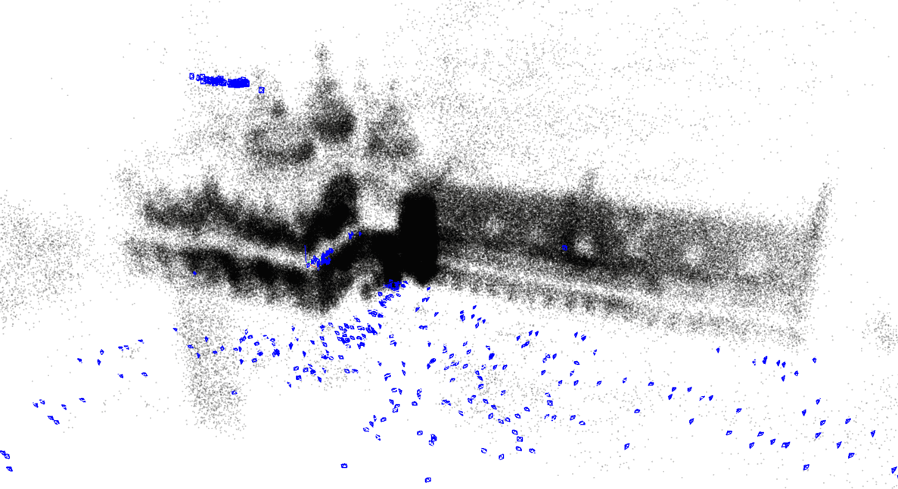

# MathematicalRobotics

## What is this?
The development of robotics is always closely related to mathematics. But sometime pure mathematical expressions are boring and difficult to understand, so I hope to show the magic of mathematics through some interesting robotics demonstrations.


## The goals of our project.
We want to select some widely used and practical algorithms. for each algorithm, we aim to 
* Provide a readable python implementation.
* Show a detailed mathematical proof.
* To show the math behind it, minimal use of third-party libraries. 

## Install 

1. Install `libsuitesparse-dev`, if you want to use the sparse solver.
```bash
sudo apt-get install -y libsuitesparse-dev
```
2. Install `mathR` (this repository)
```bash
git clone https://github.com/scomup/MathematicalRobotics.git
cd MathematicalRobotics
pip3 install -e .
```

Or Install `mathR` directly from the git URL.

```bash
pip install -e git+https://github.com/scomup/MathematicalRobotics.git#egg=mathR
```

# Demo Lists

## guass_newton_method

We have developed a Gauss-Newton method library implemented in pure Python.

* [Guass-newton Method Document](docs/guass_newton_method.pdf)
* [Newton Method Document](docs/newton_method.pdf)

We also provide some demos on Lie-Group based points matching using our library.

Lie group Document:
* [SO3 group](docs/3d_rotation_group.pdf)
* [SE3 group](docs/3d_transformation_group.pdf)

### gauss newton for 2d points matching.
```bash
python3 -m mathR.guass_newton_method.demo_2d
```


### gauss newton for 3d points matching.
```bash
python3 -m mathR.guass_newton_method.demo_3d
```


### gauss newton for linear regression.
```bash
python3 -m mathR.guass_newton_method.demo_line
```


### Graph Optimization
We have developed a graph optimization library implemented in pure Python. In comparison to well-known graph optimization libraries like g2o, gtsam, ceres, etc., our implementation is highly readable and ideal for studying purposes.


[Graph Optimization Document](docs/graph_optimization.pdf)

### 2d pose graph problem
```bash
python3 -m mathR.graph_optimization.demo_g2o_se2
```
dataset: sphere2500.g2o [^1]


### 3d pose graph problem
```bash
python3 -m mathR.graph_optimization.demo_g2o_se3
```
dataset: manhattanOlson3500.g2o [^1]

 
[^1]: Datasets are available in the open source package of [vertigo](https://github.com/OpenSLAM-org/openslam_vertigo).


### bundle adjustment
```bash
python3 -m mathR.slam.demo_bundle_adjustment
```
dataset: [Venice: problem-427-310384-pre](https://grail.cs.washington.edu/projects/bal/data/venice/problem-427-310384-pre.txt.bz2) [^2]




[^2]: The datasets used in the demo are available in the project [Bundle Adjustment in the Large](https://grail.cs.washington.edu/projects/bal/).


## geometry

### point to line ICP
```bash
python3 -m mathR.robot_geometry.demo_p2line_matching
```


### point to plane ICP

```bash
python3 -m mathR.robot_geometry.demo_p2plane_matching
```


### plane cross a cube

```bash
python3 -m mathR.robot_geometry.demo_plane_cross_cube
```


