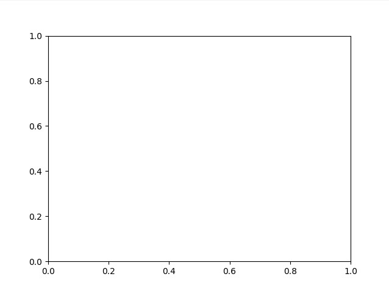
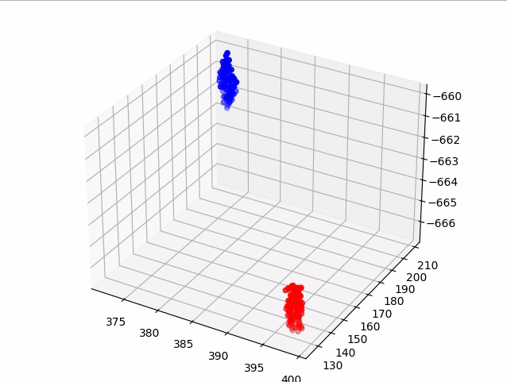
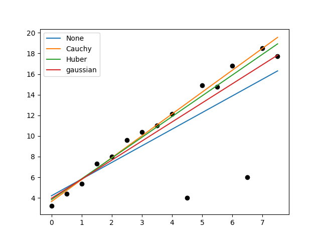
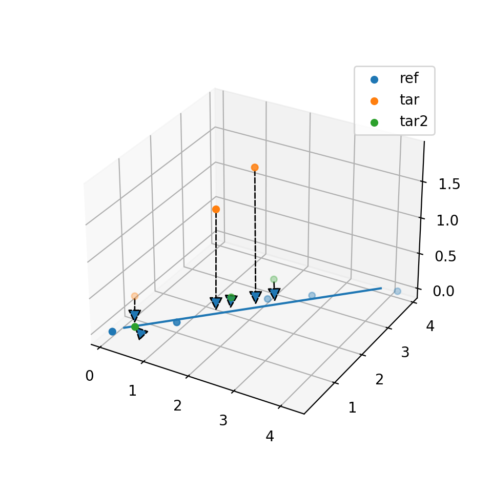
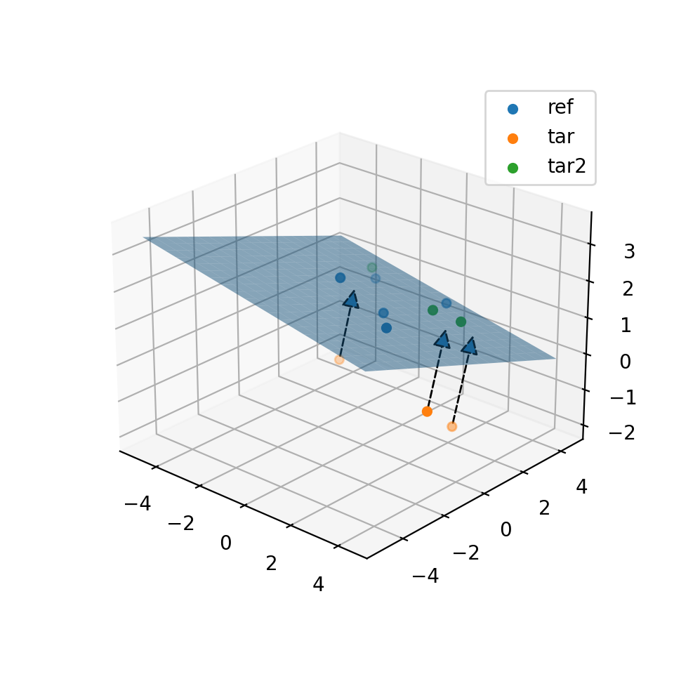
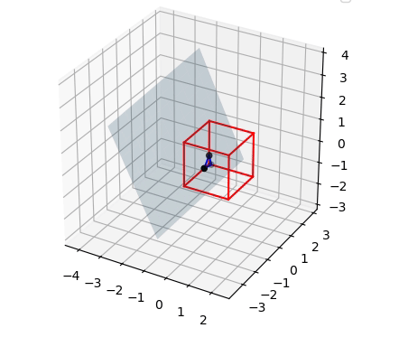
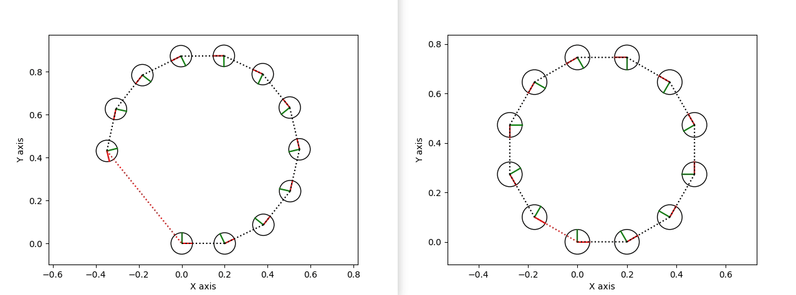
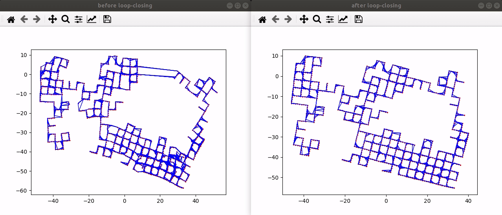
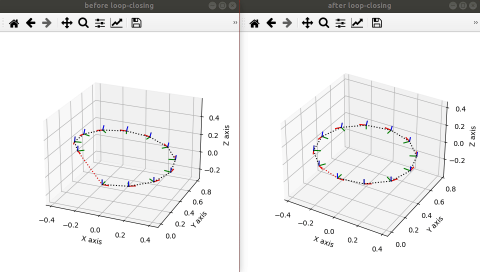
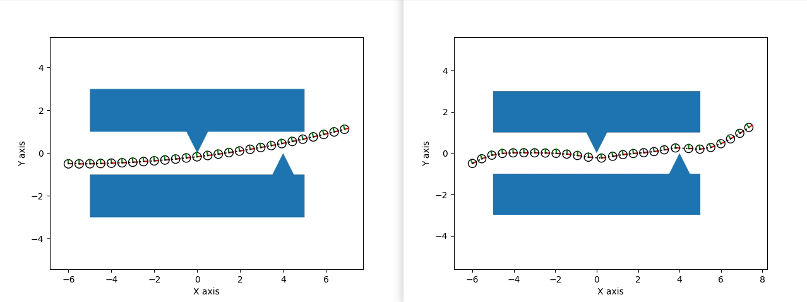

# MathematicalRobotics

## What is this?
The development of robotics is always closely related to mathematics. But sometime pure mathematical expressions are boring and difficult to understand, so I hope to show the magic of mathematics through some interesting robotics demonstrations.


## The goals of our project.
We want to select some widely used and practical algorithms. for each algorithm, we aim to 
* Provide a readable python implementation.
* Show a detailed mathematical proof.
* To show the math behind it, minimal use of third-party libraries. 

## Requirements 

```bash
pip3 install -r requirements.txt
```

## Demo Lists

### guass_newton_method

We have developed a Gauss-Newton method library implemented in pure Python.

* [Guass-newton Method Document](docs/guass_newton_method.pdf)
* [Newton Method Document](docs/newton_method.pdf)

We also provide some demos on Lie-Group based points matching using our library.

Lie group Document:
* [SO3 group](docs/3d_rotation_group.pdf)
* [SE3 group](docs/3d_transformation_group.pdf)
* Blog(Japanese): [SO3 group](https://qiita.com/scomup/items/fa9aed8870585e865117); [SE3 group](https://qiita.com/scomup/items/d82b35aeb1ecabd75e60); [Lie group based optimization](https://qiita.com/scomup/items/a9c09d57101583c58619)
#### gauss newton for 2d points matching.
guass_newton_method/demo_2d.py


#### gauss newton for 3d points matching.
guass_newton_method/demo_3d.py


#### gauss newton for linear regression.
guass_newton_method/demo_line.py


### geometry

#### point to line ICP
robot_geometry/demo_p2line_matching.py


#### point to plane ICP
robot_geometry/demo_p2plane_matching.py


#### plane cross a cube
robot_geometry/demo_plane_cross_cube.py


### Graph Optimization
We made a graph optimization library implemented in pure python. Compared to well-known libraries such as g2o, gtsam, ceres, etc., the implementation is very easy to understand and ideal for study.

* [Graph Optimization Document](docs/graph_optimization.pdf)

#### 2d simple loop closing example


graph_optimization/demo_pose2d_graph.py
docs/graph_optimization.pdf

#### 2d simple loop closing example
graph_optimization/demo_g2o_se2.py
dataset: manhattanOlson3500 (E. Olson 2006)


#### 3d simple loop closing example
graph_optimization/demo_pose3d_graph.py


#### 3d graph slam
graph_optimization/demo_g2o_se3.py
dataset: sphere2500 (M. Kaess 2012)


#### polygon
Generate a trajectory that avoids polygons(obstacles) as much as possible.  
graph_optimization/demo_polygon.py


