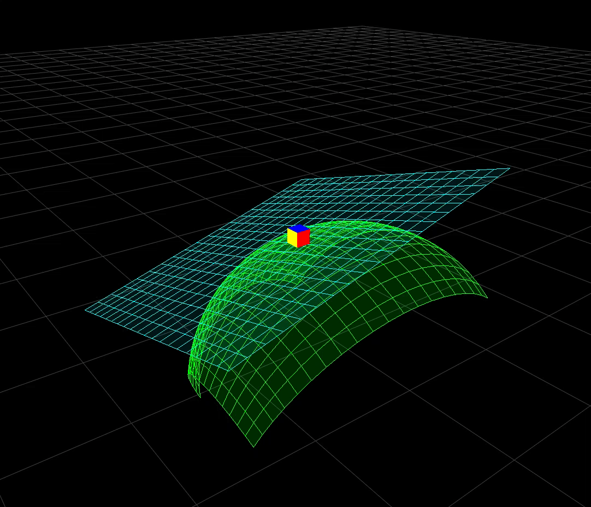
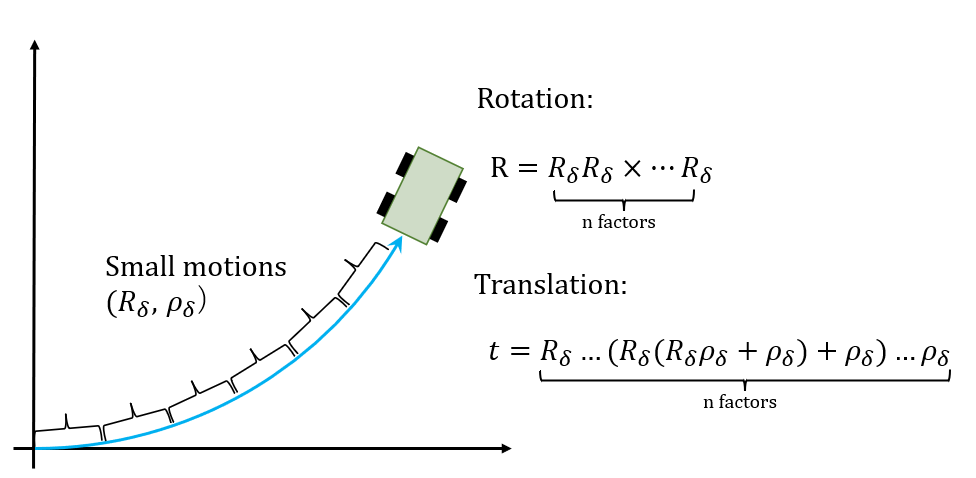

$$
\newcommand{\skew}[1]{[{#1}]_{\times}} %skew matrix
$$

$$
\newcommand{\so}[1]{ \mathfrak{so}{(#1)} } %lie algebra so3
$$

$$
\newcommand{\se}[1]{ \mathfrak{se}{(#1)} } %lie algebra se3
$$

$$
\newcommand{\norm}[1]{\|{#1}\|} %norm 
$$

# Rigid Body Transformation

A rigid body transformation is a combination of rotation and translation, where the shape of the object remains unchanged before and after the transformation.

A rigid body transformation can be expressed as a 4x4 matrix, commonly referred to as the transformation matrix. The matrix is structured as follows:

$$
T = \left[\begin{matrix} 
  R & t  \\
  \mathbf{0}^T & 1 
  \end{matrix}\right]
  \tag{1}
$$

* R：3x3 rotation matrix
* t：3-dimensional translation vector

The major advantage of representing a rigid body transformation using a matrix is that we can easily combine two transformations (2) or apply a transformation to a point (3) using matrix multiplication.

$$
T_1 T_2 = 
\left[\begin{matrix} 
  R_1 R_2 &  R_1 t_2  + t_1  \\
  0 & 1  
\end{matrix}\right] 
  \tag{2}
$$

$$
T \left[\begin{matrix} 
  p  \\
  1  \\
\end{matrix}\right]  = \left[\begin{matrix} 
  Rp +t  \\
  1  \\
\end{matrix}\right]
\tag{3}
$$

* p：3-dimensional point

The drawbacks of representing a rigid body transformation using a 4x4 rotation matrix is that it has 16 independent elements, making it redundant in optimization problems.

Furthermore, calculating the Jacobian of the transformation matrix can be complex and computationally expensive.

Group theory is an effective mathematical tool to solve these problems. The following text explains the motivation and introduces the representation of rigid body transformations using Lie groups and Lie algebras.

# Motivation

Let's consider the following problem:

A robot has 6 degrees of freedom and is moving at a constant speed (angular velocity and linear velocity denoted as ω and ρ, respectively). We want to determine the robot's pose (rotation and translation) after 1 second.

The image above shows an example of a robot (a cube) moving at a constant speed in 3D space. Due to the angular velocity, the trajectory of the motion forms a smooth curve (represented by the red line).

## Rotation

Since the velocity is constant, the robot can continuously apply the same small rotations.

$$
R =\underbrace{R_\delta \times ...  R_\delta}_\text{n factors} 
\tag{4}
$$

The formula below shows the small rotation matrix for 1/n seconds.

$$
R_\delta = I + \dfrac{\skew{\omega}}{n}
\tag{5}
$$

This composition of rotations can be calculated as an exponential map.
_described in 3d_rotation_group.pdf._

$$
R
=\lim_{n \to \infty}(I+\frac{\skew{\omega}}{n})^n = \exp(\skew{\omega})
\tag{6}
$$

## Translation

The next question is, what happens to the translation?

If it's linear motion, we can simply calculate it as velocity multiplied by time.

However, when there is angular velocity, the direction of the robot's motion changes gradually. As shown in the figure above, we need to consider it as a composition of infinitesimal translational motions.

Using equation (3), the composite formula for infinitesimal translational motion becomes as follows.

$$
\begin{aligned}
t &= R_\delta ... (R_\delta(R_\delta \rho_\delta + \rho_\delta)+\rho_\delta) ...+\rho_\delta \\
&=R_\delta^{n-1}\rho_\delta+R_\delta^{n-2}\rho_\delta ... R_\delta\rho_\delta+\rho_\delta　\\
&=\rho_\delta \sum_{k=0}^{n-1} R_\delta^{k}
\end{aligned}
\tag{7}
$$

$\rho_\delta$ is the infinitesimal translation vector over a duration of $1/n$ seconds.

$$
\rho_\delta = \dfrac{\rho}{n}
\tag{8}
$$

## Transformation

The composition of rotations (4) and translations described earlier can be combined into a single equation (9).

$$
\begin{aligned} 
T 
&=\left[\begin{matrix} 
R_\delta R_\delta \times...R_\delta  & R_\delta ... (R_\delta(R_\delta \rho_\delta + \rho_\delta)+\rho_\delta) ...+\rho_\delta\\
\mathbf{0}^T & 1 
\end{matrix}\right] \\
&= \lim_{n \to \infty} 
\left[\begin{matrix} 
  R_\delta  & \rho_\delta\\
  \mathbf{0}^T & 1 
\end{matrix}\right]^n \\
&= \lim_{n \to \infty} \left(I +  \frac{1}{n}
\left[\begin{matrix} 
  {\skew{\omega}}  & {\rho}\\
  \mathbf{0}^T & 0 
\end{matrix}\right] \right)^n \\
&= \exp{(\hat{\xi})}
\end{aligned}
\tag{9}
$$

As seen from equation (9), the rigid transformation can be represented by matrix exponential.

$\xi$ is a 6-dimensional vector composed of $\omega$ and $\rho$.

* $\xi=\left[\begin{matrix} \omega \\ \rho\end{matrix}\right]$

The symbol $\wedge$ denotes the operation that transforms a 6-dimensional vector into a 4x4 matrix.

$$
\hat{\xi} = \left[\begin{matrix} 
  \skew{\omega}  & \rho \\
  \mathbf{0}^T & 0 
\end{matrix}\right]
\tag{10}
$$

# Special Euclidean Group in 3 dimensions  SE(3)

From the previous examples, we have known that we can represent the rigid transformation as a 6-dimensional vector using the exponential mapping. Although we haven't used the term "Lie group" yet, we have already derived the essential exponential mapping in Lie group theory.

A rigid transformation $T$ in 3D rotation space is called the Special Euclidean Group $SE(3)$. It is composed of a 3D rotation and a 3D translation vector, as shown in equation (11).

$$
SE(3) =
\left(
\left.
T = \left[ {\begin{matrix} R & t \\
{{\mathbf{0}^T}} & 1 
\end{matrix}} \right]
\in \mathbb{R} ^{4 \times 4} \right|
 R \in SO(3), t \in \mathbb{R}^3
\right)
\tag{11}
$$

$SE(3)$ has 6 degrees of freedom (3 degrees of rotation and 3 degrees of translation), so its corresponding Lie algebra $\se{3}$ is a 6-dimensional vector. As already derived in the previous examples, the 6-dimensional $\se{3}$ can be transformed into $SE(3)$ using the exponential mapping.

$$
SE(3) = 
\lim_{n \to \infty}(I+\frac{\hat{\xi}}{n})^n
=\exp{\hat{\xi}} 
\tag{12}
$$

* $\xi$ belongs to　$\se{3}$.

## Exponential map

By expanding equation (12), we can calculate the exponential mapping of $SE(3)$. However, numerical computation can be challenging and it is often necessary to approximate it with a finite number of terms (resulting in lower accuracy). Therefore, let's simplify it as follows.

$$
\begin{aligned} 
\exp{\hat{\xi}}
&=\lim_{n \to \infty} 
\left[\begin{matrix} 
R_\delta  & \rho_\delta\\
\mathbf{0}^T & 1 
\end{matrix}\right]^n \\
&=
\left[\begin{matrix} 
R_\delta R_\delta \times...R_\delta  & R_\delta ... (R_\delta(R_\delta \rho_\delta + \rho_\delta)+\rho_\delta) ...+\rho_\delta \\
\mathbf{0}^T & 1 
\end{matrix}\right]
\end{aligned} 
\tag{13}
$$

In the 3d_rotation_group.pdf, we explained that the upper-left rotation part can be easily calculated using Rodrigues' formula. Therefore, let's focus on the upper-right translation part.

$$
\begin{aligned} 
t 
&= R_\delta ... (R_\delta(R_\delta \rho_\delta + \rho_\delta)+\rho_\delta) ...+\rho_\delta \\\\
&=\rho_\delta \sum_{k=0}^{n-1} R_\delta^{k}
\end{aligned}
\tag{14}
$$

By substituting equations (5) and (8) into the equation above, we can write it as follows.

$$
\begin{aligned} 
t 
&=\lim_{n \to \infty} \dfrac{\rho}{n} \sum_{k=0}^{n-1} (I + \dfrac{\skew{\omega}}{n})^{k} 
\end{aligned}
\tag{15}
$$

Equation (15) can be expanded using the binomial theorem.

$$
\begin{aligned} 
t &=\lim_{n \to \infty} \dfrac{\rho}{n} \sum_{k=0}^{n-1} (I + \dfrac{\skew{\omega}}{n})^{k} \\
&=\lim_{n \to \infty} \dfrac{\rho}{n} \sum_{k=0}^{n-1} (I + C_{k}^1 \frac{\skew{\omega}}{n} + C_{k}^2 \frac{\skew{\omega}^2}{n^2}  + C_{k}^3 \frac{\skew{\omega}^3}{n^3}...) \\
&=\lim_{n \to \infty} \rho (\sum_{k=0}^{n-1} \frac{I}{n} + \sum_{k=0}^{n-1} C_{k}^1 \frac{\skew{\omega}}{n^2} + \sum_{k=0}^{n-1} C_{k}^2 \frac{\skew{\omega}^2}{n^3}  + \sum_{k=0}^{n-1} C_{k}^3 \frac{\skew{\omega}^3}{n^4}  ... ) \\
&=\lim_{n \to \infty} \rho (I +  \frac{\sum_{k=0}^{n-1} k}{1!} \frac{\skew{\omega}}{n^2} + \frac{\sum_{k=0}^{n-1} k (k-1)}{2!} \frac{\skew{\omega}^2}{n^3}  + \frac{\sum_{k=0}^{n-1} k (k-1) (k-2)}{3!} \frac{\skew{\omega}^3}{n^4}...) \\
&\approx \lim_{n \to \infty} \rho (I +  \frac{n^2}{1! \times 2} \frac{\skew{\omega}}{n^2} + \frac{n^3 }{2! \times 3} \frac{\skew{\omega}^2}{n^3}  + \frac{n^4 }{3! \times 4} \frac{\skew{\omega}^3}{n^4}...) \\
&= \lim_{n \to \infty} \rho (I +  \frac{\skew{\omega}}{2!} +  \frac{\skew{\omega}^2}{3!}  + \frac{\skew{\omega}^3}{4!}...) \\
&= \rho \sum_{k=0}^\infty  \frac{\skew{\omega}^{k}}{(k+1)!} \\
\end{aligned} 
\tag{16}
$$

The expression in equation (16) may still appear a bit complex, as it involves an infinite series. Let's further simplify it.

We can denote the power series part of equation (16) using the symbol $J$.

* Let's define $\omega = \theta r$
    * $r$ : Unit vector of $\omega$,  $r =\dfrac{\omega}{\norm{\omega}}$ 
    * $\theta$ : Norm of $\omega$, $\theta = \norm{\omega}$ 

$$
\begin{aligned} 
J &= \sum\limits_{k = 0}^\infty 
\frac{1}{(k+1)!} (\theta \skew{r} )^k \\
&= I + 
\frac{1}{2!} \theta \skew{r} + 
\frac{1}{3!} \theta^2 \skew{r}^2 +
\frac{1}{4!} \theta^3 \skew{r}^3 +
\frac{1}{5!} \theta^4 \skew{r}^4 + ... \\
&= I + 
\frac{
\frac{1}{2!} \theta^2 \skew{r} + 
\frac{1}{3!} \theta^3 \skew{r}^2 +
\frac{1}{4!} \theta^4 \skew{r}^3 +
\frac{1}{5!} \theta^5 \skew{r}^4 + ...}
{\theta} \\
&= I + 
\frac{ 
(r-r + \frac{1}{2!} \theta^2 \skew{r} +
\frac{1}{4!} \theta^4 \skew{r}^3 + ...)
+
(\theta - \theta +\frac{1}{3!} \theta^3 \skew{r}^2 +
\frac{1}{5!} \theta^5 \skew{r}^4 + ...)
}
{\theta} \\
&= I + (\frac{1-\cos{\theta}}{\theta})\skew{r} + 
(1-\frac{\sin{\theta}}{\theta})\skew{r}^2 \\
\end{aligned} 
\tag{17}
$$

In the calculation of equation (17), the following property is used:

* $\skew{r}\skew{r}\skew{r} = -\skew{r}$

Finally, the exponential mapping of $SE(3)$ can be transformed into equation (18). With this, we have successfully transformed the 6-dimensional vector $\se3$ into the rigid transformation group. By utilizing this equation, we can represent a rigid transformation using 6 parameters.

$$
\begin{aligned} 
T
&= \exp{(\hat{\xi})} \\
&= 
\left
[\begin{matrix} 
   \exp{(\skew{\omega})} & J \rho \\
  \mathbf{0}^T & 1 
\end{matrix}\right]
\end{aligned}
\tag{18}
$$

Furthermore, the computation of this exponential mapping can be done very efficiently and quickly in practical applications.

## Logarithm map

The logarithmic mapping is the inverse of the exponential mapping and allows us to map Lie algebra to the Lie group.

The logarithmic mapping from $SE(3)$ to $\so3$ is the inverse calculation of equation (18). Let's first write the inverse calculation of equation (18).

$$
\begin{aligned} 
\xi
&= \log{(T)}^{\vee} \\
&= 
\left
[\begin{matrix} 
   \exp^{-1}{(R)}^{\vee} & J^{-1} t 
\end{matrix}\right]^T \\
&= \left
[\begin{matrix} 
   \log{(R)}^{\vee} & J^{-1} t 
\end{matrix}\right]^T \\
\end{aligned}
\tag{19}
$$

* $\vee$ is the inverse of $\wedge$ and converts a 4x4 matrix back into a 6-dimensional vector.

$\log{(R)}^{\vee}$ is the logarithmic mapping from $SO(3)$ to $\so3$, which was already discussed in 3d_rotation_group.pdf. Now let's focus on $J^{-1}$.

First, let's assume that the inverse of $J$ has the following form:

$$
J^{-1} = I + A \skew{r} + B \skew{r}^2
\tag{20}
$$
Here, $A$ and $B$ are unknown coefficients.

When we multiply $J$ and $J^{-1}$, we obtain equation (21).

$$
\begin{aligned} 
J J^{-1} 
&= I + ( \frac{A\sin{\theta}}{\theta} - \frac{B(1-\cos{\theta})}{\theta} + \frac{(1-\cos{\theta})}{\theta} )\skew{r} \\
  &\quad +(\frac{A(1-\cos{\theta})}{\theta} + \frac{B\sin{\theta}}{\theta} + \frac{(\theta-\sin{\theta})}{\theta})\skew{r}^2
\end{aligned}
\tag{21}
$$

Since the product of the inverse matrix and the original matrix should be the identity matrix, the coefficients of $\skew{r}$ and $\skew{r}^2$ in equation (21) must be zero. Therefore, we can set up the following system of equations.

$$
  \begin{cases}
     \dfrac{A\sin{\theta}}{\theta} - \dfrac{B(1-\cos{\theta})}{\theta} + \dfrac{(1-\cos{\theta})}{\theta} = 0 \\
    \dfrac{A(1-\cos{\theta})}{\theta} + \dfrac{B\sin{\theta}}{\theta} + \dfrac{(\theta-\sin{\theta})}{\theta} = 0
  \end{cases}
\tag{22}
$$

This system of equations can be easily solved, and the solution is shown in equation (23).

$$
\begin{cases}
   A = -\dfrac{\theta}{2} \\
   B = 1 - \dfrac{\theta \sin{\theta}}{2(1-\cos{\theta})}
   =\dfrac{2 \sin{\theta - \theta (1+\cos{\theta})}}{2 \sin{\theta}}
\end{cases}
\tag{23}
$$

By substituting the solution into equation (20), we can determine $J^{-1}$ as follows:

$$
J^{-1} = I - \frac{\theta \skew{r}}{2} + \frac{2 \sin{\theta - \theta (1+\cos{\theta})}}{2 \sin{\theta}} \skew{r}^2
\tag{24}
$$

Furthermore, by substituting $J^{-1}$ into equation (19), we have obtained a simplified expression for the logarithmic mapping of $SE(3)$.