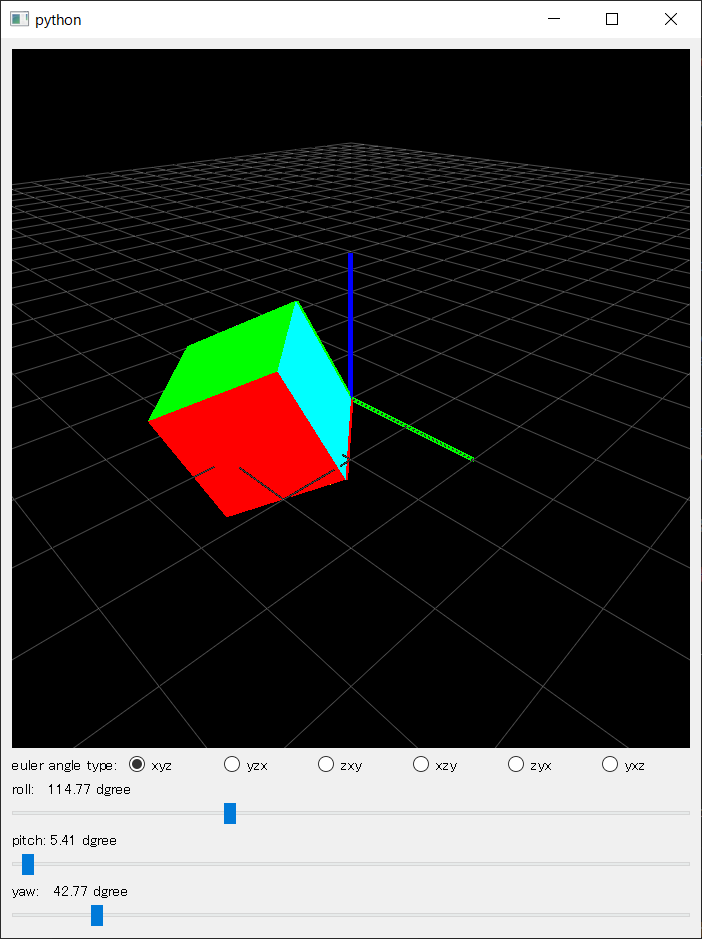
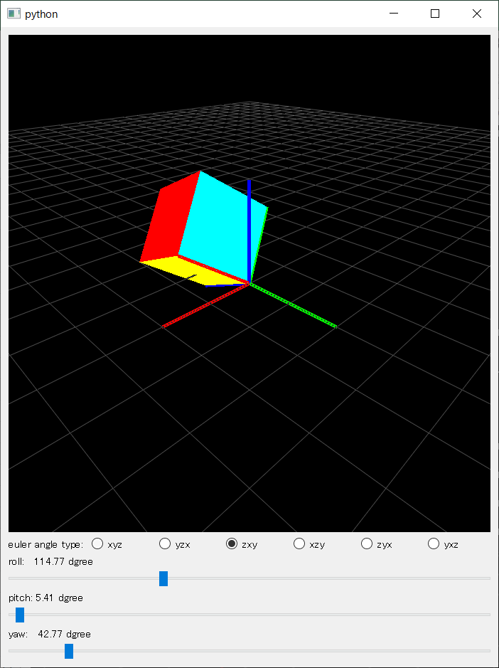
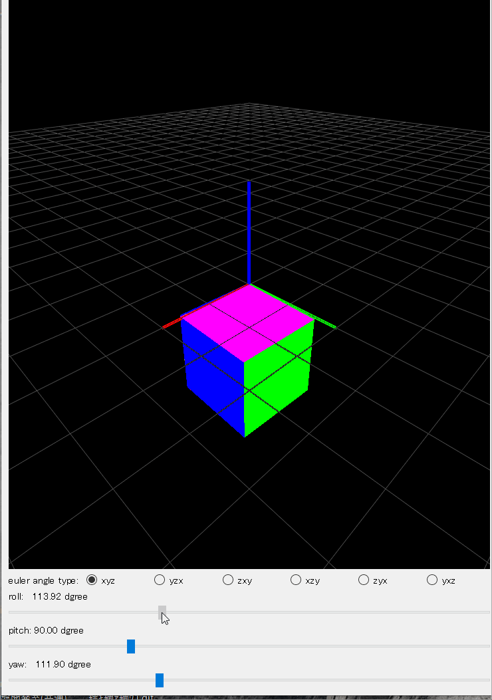
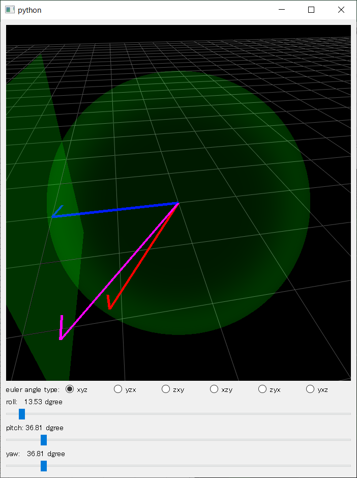

# はじめに

　ロボティクス工学だけではなく、あらゆる工学分野で3次元回転を表現する必要である。有名な回転表現方法として、回転行列(rotation matrix)、オイラー角(euler angles)、クォーテーション(quaternion)、軸角(Axis-angle)などが挙げられる。しかし、近年、リー群(Lie Group)による回転表現をロボティクスの研究に導入して、非常に有効であることを示した。リー群による回転表現を理解しないと、最新のロボティクス論文(特にSLAM)が読めないと言っても過言ではない。
　しかし、大学時代に群論(Group theory)を勉強したことがある人が少なく、いきなり群を勉強しても、どこから勉強すればいいかわからないでしょう。この文章は、従来の回転表現から、リー群・リー代数による回転表現を導入し、なぜリー群・リー代数が必要か、工学的にどんな感じで応用しているかを説明する。この文章を読んだら、短い時間SLAM研究に必要な回転、リー群とリー代数の知識をキャッチアップできたら嬉しい。

# 回転行列
　最もシンプルな3次元回転表現は3X3の回転行列である。行列掛け算だけで、回転が適用できるため、非常に高速的に計算ができる。しかし、3X3の回転行列は9個の独立変数があり、非常に冗長な表現である。もし、最適化より回転を推定するとき、直接に3X3の行列を使いたら、結果として、回転行列ではない行列が得られるでしょう。

# オイラー角
 オイラー角はレオンハルト・オイラーにより考案された。各座標軸まわりの3つの回転の順番的に組み合わせた回転表現である．

各座標軸まわりの3つの回転は以下のように定義する。

* $\alpha$: *Roll*, x軸まわりに角度
* $\beta$:  *Pitch*, y軸まわりに角度
* $\gamma$: *Yaw*, z軸まわりに角度

イメージ：

x軸まわりの回転行列
$$
R_x(\alpha) = 
\left[\begin{matrix} 1 & 0 & 0 \\
0 & cos\alpha & -sin\alpha \\
0 & sin\alpha & cos\alpha
\end{matrix}\right]
\tag{1}
$$

y軸まわりの回転行列

$$
R_y(\beta) = \left[\begin{matrix} cos\beta & 0 & sin\beta \\
0 & 1 & 0 \\
-sin\beta & 0 & cos\beta \end{matrix}
\right]
\tag{2}
$$

z軸まわりの回転行列

$$
R_z(\gamma) = 
\left[\begin{matrix} cos\gamma & -sin\gamma & 0 \\
sin\gamma & cos\gamma & 0 \\ 0 & 0 & 1 
\end{matrix}\right]
\tag{3}
$$

以上、三つの回転行列を掛け算すると、任意の三次元回転を表現できるが、行列の掛け算は可換則を満たさないため、x,y,z回転の順序が変わると、最終的に異なる回転行列が生成される。

全部で12通りの表現法がある。

 <table>
    <tr>
      <td>xyz</td><td>xzy</td><td>yxz</td><td>yzx</td><td>zxy</td><td>zyx</td>
    </tr>
    <tr>
      <td>xyx</td><td>xzx</td><td>yxy</td><td>yzy</td><td>zxz</td><td>zyz</td>
    </tr>
 </table>

以下はXYZとZXYオイラー角の計算を示す

**XYZオイラー角**

$$
\begin{aligned} R_{xyz}(\alpha, \beta, \gamma) 
&=
  R_z (\gamma) R_y (\beta) R_x (\alpha) \\
&= 
\left[\begin{matrix} cos\gamma & -sin\gamma & 0 \\
sin\gamma & cos\gamma & 0 \\ 0 & 0 & 1 
\end{matrix}\right]
\left[\begin{matrix} cos\beta & 0 & sin\beta \\
0 & 1 & 0 \\
-sin\beta & 0 & cos\beta 
\end{matrix}\right] 
\left[\begin{matrix} 1 & 0 & 0 \\
0 & cos\alpha & -sin\alpha \\
0 & sin\alpha & cos\alpha
\end{matrix}\right] \\
&= 
\left[\begin{matrix} c_{\gamma} c_{\beta} & c_{\gamma} s_{\beta} s_{\alpha} - c_{\alpha} s_{\gamma} & s_{\gamma} s_{\alpha} + c_{\gamma} c_{\alpha} s_{\beta} \\
c_{\beta} s_{\gamma} & c_{\gamma} c_{\alpha} + s_{\gamma} s_{\beta} s_{\alpha} & c_{\alpha} s_{\gamma} s_{\beta}- c_{\gamma} s_{\alpha} \\
-s_{\beta} & c_{\beta} s_{\alpha} & c_{\beta} c_{\alpha} \\
\end{matrix}\right]
\end{aligned} \tag{4}
$$

**ZXYオイラー角**
$$
\begin{aligned} R_{zxy}(\alpha, \beta, \gamma) 
&=
R_y (\beta) R_x (\alpha) R_z (\gamma) \\
&= 
\left[\begin{matrix} cos\beta & 0 & sin\beta \\
0 & 1 & 0 \\
-sin\beta & 0 & cos\beta 
\end{matrix}\right] 
\left[\begin{matrix} 1 & 0 & 0 \\
0 & cos\alpha & -sin\alpha \\
0 & sin\alpha & cos\alpha
\end{matrix}\right]
\left[\begin{matrix} cos\gamma & -sin\gamma & 0 \\
sin\gamma & cos\gamma & 0 \\ 0 & 0 & 1 
\end{matrix}\right] \\ 
&= 
\left[\begin{matrix} c_{\beta} c_{\gamma}+s_{\beta} s_{\alpha} s_{\gamma} & c_{\gamma} s_{\beta} s_{\alpha}-c_{\beta} s_{\gamma} & c_{\alpha}s_{\beta} \\ 
c_{\alpha} s_{\gamma} & c_{\alpha} c_{\gamma} & -s_{\alpha} \\
c_{\beta} s_{\alpha} s_{\gamma}-s_{\beta} c_{\gamma} & s_{\beta} s_{\gamma}+c_{\beta} c_{\gamma} s_{\alpha} & c_{\beta} c_{\alpha}
\end{matrix}\right]
\end{aligned} 
\tag{5}
$$

なお、オイラー角を使うとき、回転の順番を決めることが非常に重要である。

  
  
  
同じ数値だが、XYZとZXYオイラー角が違う
 

## ジンバルロック

オイラー角は頻繁に使われるが、ジンバルロックという問題も有名である。
例えば、XYZオイラー角の場合、pitch=90°のとき、rollとyawは同じ軸をまわる。

証明：
$$
\begin{aligned} R_{xyz}(\alpha, \frac{\pi}{2}, \gamma) \left[\begin{matrix} 1  \\0 \\ 0 
\end{matrix}\right] 
&=
\left[\begin{matrix} c\gamma & -s\gamma & 0 \\
s\gamma & c\gamma & 0 \\ 0 & 0 & 1 
\end{matrix}\right]
\left[\begin{matrix} 0 & 0 & 1 \\
0 & 1 & 0 \\
-1 & 0 & 0 
\end{matrix}\right] 
\left[\begin{matrix} 1 & 0 & 0 \\
0 & c\alpha & -s\alpha \\
0 & s\alpha & c\alpha
\end{matrix}\right] 
\left[\begin{matrix} 1  \\0 \\ 0 
\end{matrix}\right] \\
&= 
\left[\begin{matrix} 0  \\0 \\ -1 
\end{matrix}\right]
\end{aligned} \tag{4}
$$

ジンバルロックのイメージ：

ジンバルロック問題のが存在するために、オイラー角は数学的に非連続的な回転表現である。また、非可換という性質があるため、多くの数学的問題で扱いにくいものとなる。

## 微小回転

オイラー角の問題を解決するため、先に微小な回転を考えよう。

三角代数的に角度が十分小さければ、以下の式が成り立つ。

* $cos(a) \approx 1$
* $sin(a)\approx a$
* $sin(a)sin(b) \approx 0$

上記式を(4)、(5)に代入すると、全く同じ結果が得られる。
なお、微小な回転はオイラー角と違う、数学的に可換であることがわかる。

$\gdef\skew#1{[{#1}]_{\times}}$

$$
\begin{aligned} 
R_{xyz} \approx R_{zxy} &\approx
\left[\begin{matrix} 1 &  -  \gamma & \beta \\
\gamma & 1 & - \alpha \\
-\beta & \alpha & 1 \\
\end{matrix}\right] \\
&= I + 
\left[\begin{matrix} 0 &  -  \gamma & \beta \\
\gamma & 0 & - \alpha \\
-\beta & \alpha & 0 \\
\end{matrix}\right] \\
&= I + \skew{\omega}
\end{aligned} 
\qquad if \quad \alpha, \beta, \gamma \ll 1
\tag{6}
$$

$\skew{\omega}$ は $\alpha$, $\beta$ と $\gamma$から構成された交代行列([skew-symmetric matrix](https://en.wikipedia.org/wiki/Skew-symmetric_matrix))である。

以下の図は微小回転の近似(紫)と本当の回転(赤)を同じベクトル（青）を回転する結果を示す。
一方、本当の回転の結果は球面で動かす、一方、微小回転はこの球面の接平面(Tangent space)で動かす。球面は滑らかな空間のため、回転が小さいとき、近似結果の精度も十分高い。

  
  
  
微小回転の近似(紫)
  と本当の回転(赤)
  がオリジナルベクトル（青）を回転させる
 

## 回転の合成
これで小さな回転を可換表現で表すことができたが。残る問題は、より大きな回転をどのように表現するか？

とてもシンプルな発想として、大きな回転な3次元ベクトル$\omega$をn個（無限大に近い）に小っちゃく分割し、掛け算で合成すればよい。

$$
R(\omega) =
\underbrace{(I+\frac{\skew{\omega}}{n}) \times ...  (I+\frac{\skew{\omega}}{n})}_\text{n factors}
=(I+\frac{\skew{\omega}}{n})^n
\tag{7}
$$

敏感な数学神経がある人なら、この式を見たら興奮するでしょう、実数の場合、この級数は非常に有名で、指数関数の積表現である。同様に、指数関数の積表現を交代行列に拡張することができる。

$$
R(\omega) 
=(I+\frac{\skew{\omega}}{n})^n = e^{\skew{\omega}}
\tag{8}
$$

また、指数和の公式も交代行列に適用できる。ここで、我々は指数写像(8)、(9)を用いて、3次元ベクトルを回転行列に変換することができる。

$$
R(\omega) 
= e^{\skew{\omega}}
=\sum_{k=0}^\infty \frac{\skew{\omega}^k}{k!}
\tag{9}
$$
$\gdef\so3{\mathfrak{so}(3)}$

ここまで、リー群という言葉を一回も使ってないが、実際に、上記は既にリー群の知識を一部的に議論しました。3次元回転空間 $R$ は、*特殊直交群* $SO(3)$ と呼ばれる。3次元ベクトル $\omega$ は、リー代数 $\so3$ と呼ばれ,指数写像によって $SO(3)$ に変換することができる。

## 群

ここから群([Group](https://en.wikipedia.org/wiki/Group_(mathematics)
))の基本を軽く紹介するが、以下4つの群の公理を満たす集合は群である。

* 閉集合:
 if $ a_1, a_2 \in G$, then $a_1 \cdot a_2 \in G$
* 結合則:
 if $ a_1, a_2, a_3 \in G$, then $(a_1 \cdot a_2) \cdot a_3 = a_1 \cdot ( a_2 \cdot a_3) $
* 単位元:
 For every $ a \in G$, there exists a $a_0 \in G$, such that $ a_0 \cdot a = a \cdot a_0 = a $
* 逆元:
 For every $ a \in G$, there exists a $a^{-1} \in G$, such that $ a \cdot a^{-1} = a_0 $

例えば、ルービックキューブは群であり、群の公理がすべて満たされていることを簡単に検証することができる。

## リー群

リー群は連続的な群であり、リー群は無限に微分可能（滑らか）であることを意味する。
したがって、ルービックキューブ群は群であるが、リー群ではない。3次元回転空間は、リー群であると同時に群である。

リー群は以下の利点があるから、最近のSLAM研究では、回転表現にリー群やリー代数を用いることが多い。

* リー代数は3つの値で回転を表すことができる。
* リー群、リー代数は微分可能である。
* リー群、リー代数にはジンバルロック問題がない。
* 小さな回転では、容易に線形化される(6)。

## 3次元の特殊直交群 $SO(3)$

### 指数写像(Exponential map)

(8)や(9)で$\so3$を$SO(3)$に変換することができるが、計算が煩雑であるため、以下で計算を簡略化する。

$\gdef\norm#1{\|{#1}\|}$

$\omega = \theta r$ を定義する。

* $r$ $\omega$の単位ベクトル,  $ r =\frac{\omega}{\norm{\omega}} $ 
* $\theta$ は $\omega$のノルム, $ \theta = \norm{\omega} $  

$$
\begin{aligned} 
\exp ( \skew{\omega} ) 
&= \exp ( \theta \skew{r} ) \\ 
&= \sum\limits_{k = 0}^\infty 
\frac{1}{k!} (\theta \skew{r} )^n \\
&= I + \theta \skew{r} + 
\frac{1}{2!} \theta^2 \skew{r}^2 +
\frac{1}{3!} \theta^3 \skew{r}^3 +
\frac{1}{4!} \theta^4 \skew{r}^4 + ... \\ 
&= r^T r - 
\skew{r}^2 + \theta \skew{r} +
\frac{1}{2!} \theta^2 \skew{r}^2 +
\frac{1}{3!} \theta^3 \skew{r}^3 +
\frac{1}{4!} \theta^4 \skew{r}^4 + ... \\ 
&= r^T r - (\skew{r}^2 - 
\frac{1}{2!} \theta^2 \skew{r}^2 -
\frac{1}{4!} \theta^4 \skew{r}^4 - ...) + (\theta \skew{r} +\frac{1}{3!} \theta^3 \skew{r}^3 + ...) \\ 
&= r^T r - (1 - 
\frac{1}{2!} \theta^2  +
\frac{1}{4!} \theta^4  - ...)\skew{r}^2 + (\theta -\frac{1}{3!}  \skew{r}^3 + ...)\skew{r} \\ 
&= r^T r - cos\theta \skew{r}^2 + sin\theta\skew{r} \\ 
&= \skew{r}^2 + I - cos\theta \skew{r}^2 + sin\theta\skew{r} \\ 
&= I + (1- cos\theta) \skew{r}^2 + sin\theta\skew{r} 
\end{aligned} 
\tag{10}
$$

(10)では、交代行列の2つの性質が使われている。$r$は単位ベクトルのとき：

* $\skew{r}\skew{r}\skew{r} = -\skew{r} $
* $r^Tr = \skew{r}^2 + I $

(10)式は、[Rodrigues' Formula](https://en.wikipedia.org/wiki/Rodrigues%27_rotation_formula).として知られている、$\so3$から$SO(3)$への指数写像の高速に計算する方法である。

### 対数写像 (Logarithm map)

指数写像と逆に、対数写像は指数写像の逆計算であり、リー代数をリー群を対応させることができる。

式(10)は、行列として書くことができる。

$$
\begin{aligned} 
R(\theta, r) 
&= I + (1- cos\theta) \
\left[\begin{matrix} 
1-r_1^2  & r_1 r_2 & r_1 r_3 \\
r_1 r_2 & 1-r_1^2 & -r_2 r_3 \\
-r_1 r_3 & r_2 r_3 & 1-r_1^2 \\
\end{matrix}\right] + 
sin\theta
\left[\begin{matrix} 
0 & -r_3 & r_2 \\
r_3 & 0 & -r_1 \\
-r_2 & r_1 & 0 \\
\end{matrix}\right] \\
&= \left[\begin{matrix} 
r_1^2 (1-cos\theta) + cos\theta        & r_1 r_2 (1-cos\theta) - r_3 sin\theta & r_1 r_3 (1-cos\theta) + r_2 sin\theta\\
r_1 r_2 (1-cos\theta) +r_3 sin\theta   & r_2^2 (1-cos\theta) + cos\theta      & -r_2 r_3 (1-cos\theta) - r_1 sin\theta\\
-r_1 r_3 (1-cos\theta) -r_2 sin\theta  & r_2 r_3 (1-cos\theta) + r_1 sin\theta & r_3^2 (1-cos\theta) + cos\theta\\
\end{matrix}\right]
\end{aligned} 
\tag{11}
$$

(11)から：

$$
\theta = arccos( \frac{1}{2}(R_{11} + R_{22} + R_{33} -1)) \\
= arccos( \frac{1}{2}(tr(r)) -1)
\tag{12}
$$

$$
r = [ R_{32} - R_{23}, R_{13} - R_{31}, R_{12} - R_{21}]/2 sin \theta 
\tag{13}
$$

(12) (13)より、対数写像は以下のように計算することができる。
$$
log(R)^{\vee} = \omega = \frac{\theta[ R_{32} - R_{23}, R_{13} - R_{31}, R_{12} - R_{21}]}{2 sin \theta}  
\tag{14}
$$

